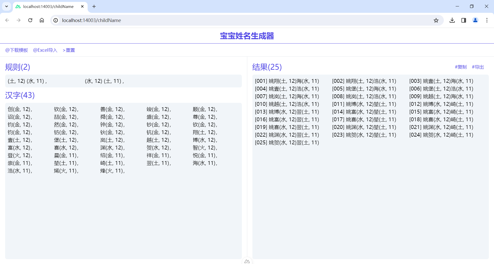

# Child Name
Nuxt@3 + tailwindcss.

## Background
Web Application to help Name the baby.

## Dev
```bash
npm install
npm run dev
```

## Build & Deploy
```
npm run build
pm2 start pm2.config.js
```

## Demo
